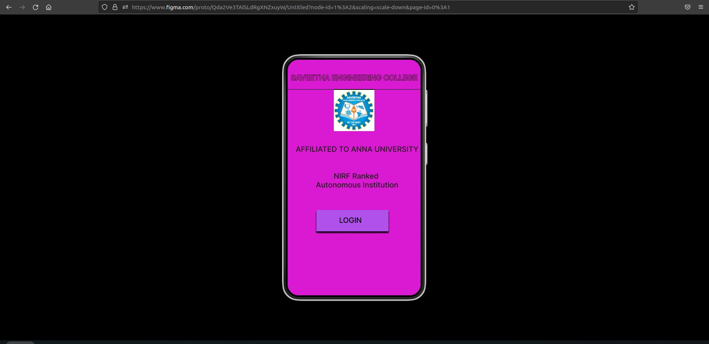
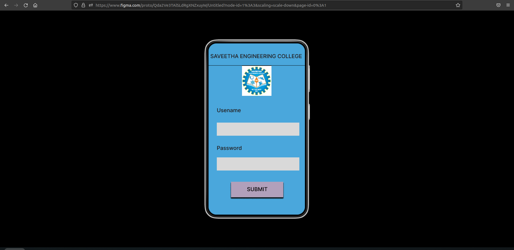
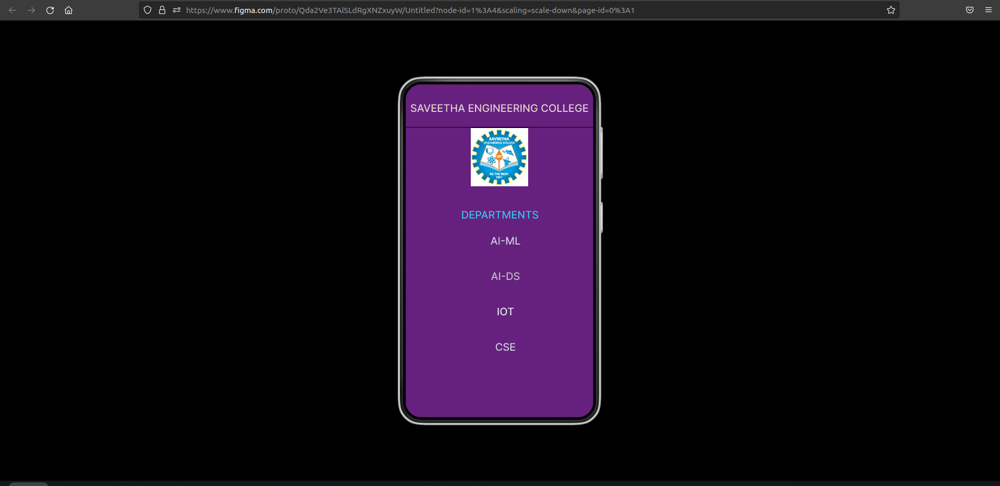

# Event Registration Web Application

## AIM:
To design, develop and deploy a web application for event registration.

## DESIGN STEPS:

### Step 1:
Create a new frame.

### Step 2:
Select any one preset size of your choice.

### Step 3:
Select the shapes you need.

### Step 4:
Import images as needed.

### Step 5:
Create pages based on your need and link them.

### Step 6:

Validate the HTML and CSS code.

### Step 6:

Publish the website in the given URL.

## DESIGN TOOL:
Figma

## CODE:
```
/* Home Page */
position: relative;
width: 360px;
height: 703px;
background: #DA19D2;

/* logoz 1 */
position: absolute;
width: 110px;
height: 113px;
left: 125px;
top: 81px;
background: url(logoz.png);


/* Login Page */
position: relative;
width: 360px;
height: 703px;
background: #4AA7DC;

/* SAVEETHA ENGINEERING COLLEGE */
position: absolute;
width: 344px;
height: 33px;
left: 8px;
top: 34px;
font-family: 'Inter';
font-style: normal;
font-weight: 500;
font-size: 20px;
line-height: 24px;
text-align: center;
color: #DFCFCF;

/* SEC Page */
position: relative;
width: 360px;
height: 703px;
background: #66207E;

/* Line 3 */
position: absolute;
width: 363px;
height: 0px;
left: -2px;
top: 83px;
border: 1px solid #000000;

/* DEPARTMENTS */
position: absolute;
width: 344px;
height: 33px;
left: 9px;
top: 239px;
font-family: 'Inter';
font-style: normal;
font-weight: 500;
font-size: 20px;
line-height: 24px;
text-align: center;

color: #38BFEA;

/* AI-ML */
position: absolute;
width: 355px;
height: 34px;
left: 14px;
top: 289px;
font-family: 'Inter';
font-style: normal;
font-weight: 500;
font-size: 20px;
line-height: 24px;
text-align: center;

color: #C9CCDD;

/* AI-DS */
position: absolute;
width: 355px;
height: 34px;
left: 14px;
top: 357px;
font-family: 'Inter';
font-style: normal;
font-weight: 500;
font-size: 20px;
line-height: 24px;
text-align: center;
color: #B8BAC4;

/* IOT */
position: absolute;
width: 355px;
height: 34px;
left: 14px;
top: 425px;
font-family: 'Inter';
font-style: normal;
font-weight: 500;
font-size: 20px;
line-height: 24px;
text-align: center;
color: #E0E3EF;

/* CSE */
position: absolute;
width: 355px;
height: 34px;
left: 14px;
top: 493px;
font-family: 'Inter';
font-style: normal;
font-weight: 500;
font-size: 20px;
line-height: 24px;
text-align: center;
color: #CACDD9;
```

## OUTPUT:





## RESULT:
The program to design, develop and deploy a web application for event registration is completed successfully.